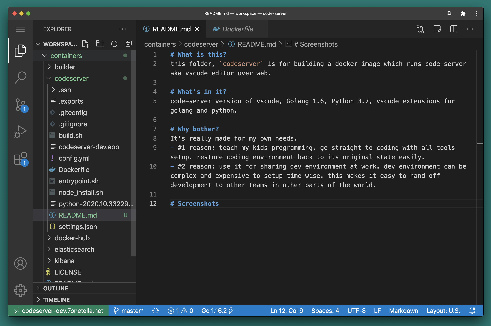
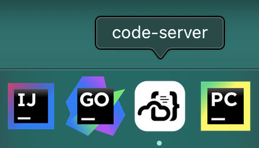
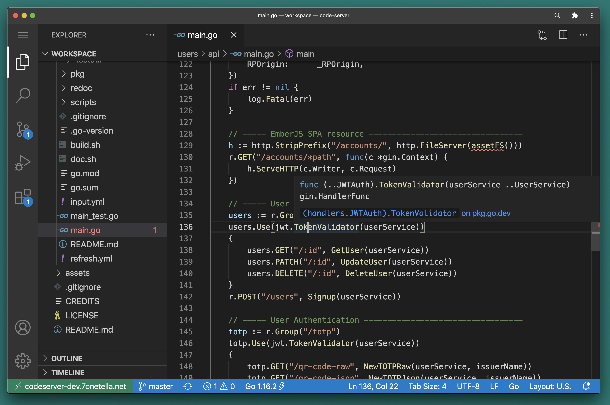

# What is this?
this folder, `codeserver` is for building a docker image which runs code-server aka vscode editor over web.

# What's in it?
code-server version of vscode, Golang 1.6, Python 3.7, vscode extensions for golang and python.

# Why bother?
It's really made for my own needs. 
- #1 reason: teach my kids programming. go straight to coding with all tools setup. restore coding environment back to its original state easily.
- #2 reason: use it for sharing dev environment at work. dev environment can be complex and expensive to setup time wise. this makes it easy to hand off development to other teams in other parts of the world.

# Screenshots
Screenshot of my own code-server while writing this README.md

Application shortcut icon on MacOSX doc

cmd + hover over a golang function

# How is my code-server running? 
my code-server docker instance is running behind a reverse proxy with TLS cert at home lab environment. I can run this docker image anywhere if I want to. 

# Why bother with TLS cert if running at home?
Chrome will let you create a PWA(Progressive Web App) shortcut only when running with TLS. PWA means no browser tab, running as its own application. 

Read more about PWA [here](https://support.google.com/chrome/answer/9658361?co=GENIE.Platform%3DDesktop&hl=en)